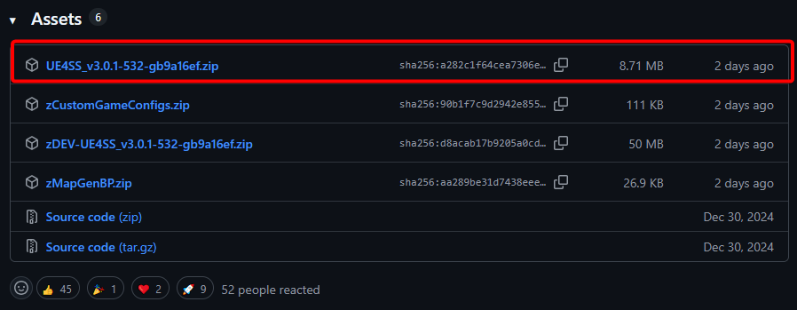
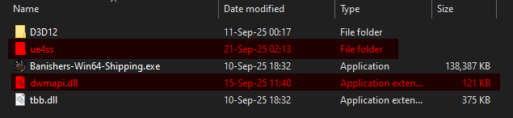
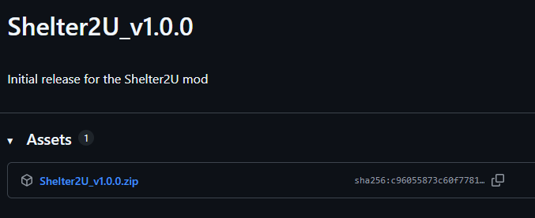
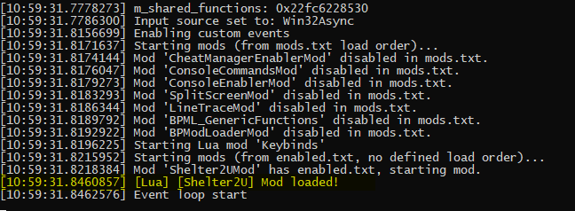

# Shelter2U - Fast Travel Mod
A [UE4SS](https://github.com/UE4SS-RE/RE-UE4SS)-based mod for Banishers: Ghosts of New Eden.

Enables the player to spawn a shelter wherever the camera is looking via a hotkey allowing for fast travel, rest and gear upgrades while out in the open world.

> _"If I cannae get to the shelter, the shelter's coming to me._

No more backtracking!

# Installation
1. First, head over to [UE4SS's releases page on GitHub](https://github.com/UE4SS-RE/RE-UE4SS/releases) and scroll down to the "Assets" dropdown.

    Click on it and grab the archive for `experimental-latest` - as of the time of writing (24th of Sep. 2025), that would be `UE4SS_v3.0.1-532-gb9a16ef.zip`.
    
    

2. Place the archive you just downloaded _next_ to the game's executable.

    Assuming you're using Steam, the location would be: 
    `<YOUR_DRIVE>\steamapps\common\Banishers Ghosts of New Eden\NWD\Binaries\Win64`

    Unpack the archive with a program of your choice. 
    This is what the above directory should now look like: 
    

3. Next, open up the [releases page for this mod](https://github.com/Faith001/Shelter2U/releases) click on the "Assets" dropdown again and download the latest version - as of the time of writing that would be `Shelter2U_v1.0.0.zip`

    Download this zip and just like in step 2, place it _next_ to the game's executable and unpack it. 
    When asked to overwrite some files, click `Yes to all`.
    > The mod overwrites the default `mods.txt` and `UE4SS-settings.ini` so you don't have to edit them by hand.
    
    Do note the order of operations, UE4SS needs to be unpacked _first_ and this mod second.

4. Finally, launch the game.

    If everything went well you should see a Windows Console pop up with the following text:
    

    While in game, press `CTRL + F1` while looking at a location to spawn a shelter there.
    > The default keybind can be changed by editing `config.lua` inside of `..\steamapps\common\Banishers Ghosts of New Eden\NWD\Binaries\Win64\ue4ss\Mods\Shelter2UMod\Scripts`

    

5. That's it, enjoy!

# Disclaimers
There are certain scripted / linear parts of the game where fast travel is forbidden, where I don't recommend using this mod as it may lead to issues or weird breakage further down the line.

  
Spoiler warning - click to expand

  Like the Inkwell for example, or the events on Siridean's Island following the Inkwell. 
  The same applies to Void Travel.

 

The main use case for this mod is being able to quickly get back to a camp from anywhere while doing side activities out in the open world.

Use common sense and make sure to save often!
